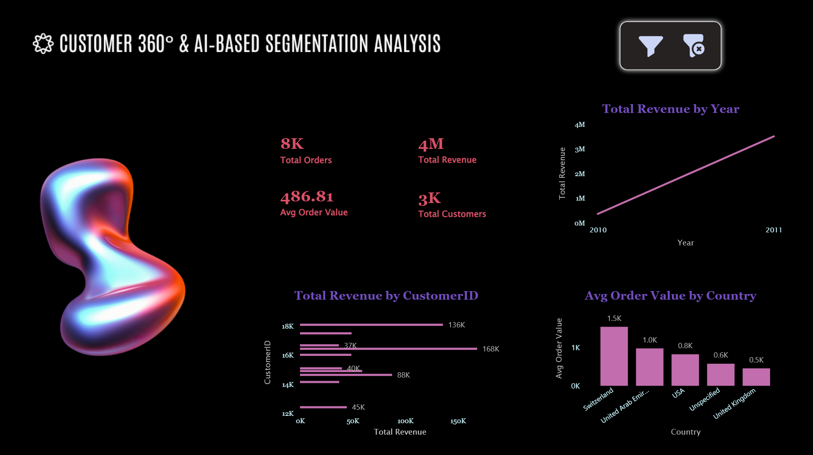

# Customer 360° & AI-Based Segmentation Analysis | Power BI Dashboard

## Overview
Customer analytics dashboard focused on revenue performance, 
order behaviour, and geographic segmentation.

## Dashboard Preview

## Key Metrics
- Total Orders: 8K
- Total Revenue: $4M
- Average Order Value: $486.81
- Total Customers: 3K

## Key Insights
- Top customer contributed $168K in individual revenue
- Switzerland had highest average order value at $1.5K
- Revenue showed consistent upward growth trajectory 2010–2011
- Geographic AOV analysis across Switzerland, UAE, USA, UK

## Tools Used
- Microsoft Power BI
- DAX
- Customer Analytics
- Segmentation Analysis
- Data Visualization
